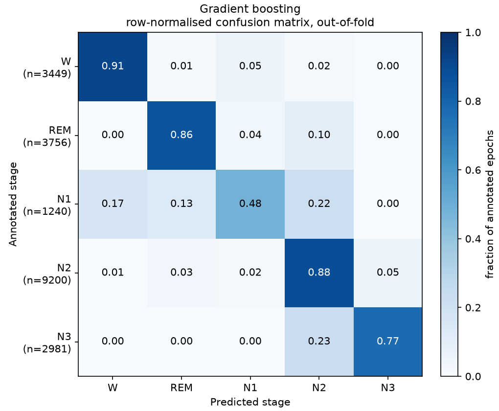
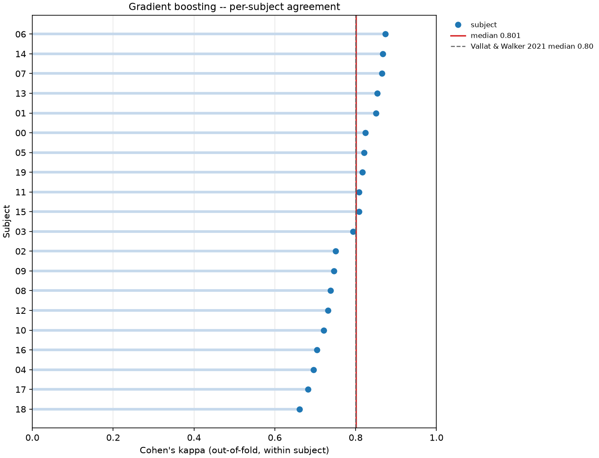
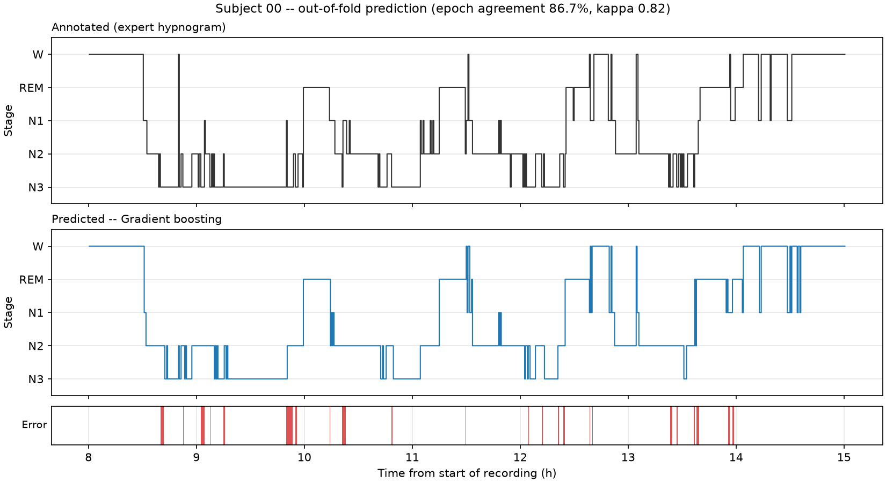

# Sleep staging on Sleep-EDF Expanded

A small, reproducible five-class sleep staging pipeline built on the public
[Sleep-EDF Expanded](https://physionet.org/content/sleep-edfx/1.0.0/)
sleep-cassette recordings, fetched through
`mne.datasets.sleep_physionet.age.fetch_data`.

The priority is **methodological correctness over model performance**. The
feature set follows the hand-crafted approach of
[Vallat & Walker 2021](https://doi.org/10.7554/eLife.70092) (the YASA
algorithm) rather than switching to deep learning; what is treated carefully is
the evaluation: subject-wise splits, no preprocessing fitted across folds, and
metrics chosen for a heavily imbalanced problem.

---

## Quick start

```bash
python -m venv .venv && .venv/Scripts/activate    # Linux/macOS: source .venv/bin/activate
pip install -r requirements.txt
python -m src.cli run --subjects 20 --folds 5 -v
```

The first run downloads ~960 MB of EDF into `data/raw/` (cached; `data/` is
git-ignored), extracts features into `data/derivatives/`, and writes figures to
`figures/` plus a metrics summary to `results/metrics.json`. Subsequent runs
reuse the feature cache and take seconds.

```bash
python -m pytest
```

The test suite is fully synthetic — it never downloads anything.

---

## Pipeline

### 1. Data (`src/data.py`)

* Eight subjects, night 1, sleep-cassette (`SC4ss1E0`). The subject id is
  parsed out of the filename and becomes the cross-validation group.
* Channels `EEG Fpz-Cz` and `EEG Pz-Oz` are kept; EOG, EMG and the respiration
  channels are dropped.
* Band-pass **0.3–35 Hz** (FIR, `firwin`), applied to the *continuous* signal
  before any cropping, so filter edge artefacts land in the discarded wake
  tails rather than at the edge of the sleep period.
* Epochs are cut with `mne.events_from_annotations(..., chunk_duration=30 s)`,
  so every 30 s window is aligned to the hypnogram by construction and never
  straddles two scored stages.
* Stage mapping (`config.STAGE_MAP`):

  | Annotation | Class |
  |---|---|
  | `Sleep stage W` | `W` |
  | `Sleep stage 1` | `N1` |
  | `Sleep stage 2` | `N2` |
  | `Sleep stage 3`, `Sleep stage 4` | `N3` (merged, per the AASM re-scoring of R&K) |
  | `Sleep stage R` | `REM` |
  | `Sleep stage ?`, `Movement time` | **dropped**, not assigned a class |

* **Sleep-period crop.** Cassette recordings span ~20 h, most of it wake with
  the subject out of bed. Only the interval from 30 min before the first
  non-wake epoch to 30 min after the last is kept. Without this the task
  collapses into wake detection; `--no-crop` reproduces the uncropped
  behaviour if you want to see that effect.

### 2. Features (`src/features.py`)

**39 features per 30 s epoch**, and the feature set differs by modality because
the channels do:

| Channel | n | Features |
|---|---|---|
| `EEG Fpz-Cz`, `EEG Pz-Oz` | 14 each | 5 relative band powers, spectral entropy, log absolute power, permutation entropy, Higuchi FD, Petrosian FD, 4 log band-power ratios |
| `EOG horizontal` | 9 | 5 relative band powers, spectral entropy, log absolute power, permutation entropy, log std |
| `EMG submental` | 2 | log std, log IQR — **no spectral features** |

Bands are delta 0.5–4, theta 4–8, alpha 8–12, sigma 12–16, beta 16–30 Hz; ratios
are delta/beta, delta/theta, theta/alpha, alpha/sigma.

#### Why the EMG gets only two features

Sleep-EDF's `EMG submental` is **recorded at 1 Hz** and interpolated up to 100 Hz
by MNE when the file is read. Its Nyquist limit is 0.5 Hz, so every band in the
list above would consist purely of interpolation artefact. Worse, the 0.3–35 Hz
band-pass retains only **10 %** of its variance (measured; the EOG retains 98 %),
because almost all of its real content sits below the high-pass edge. It is
therefore excluded from the band-pass — `raw.filter(picks=SPECTRAL_CHANNELS)` —
and reduced to two amplitude features that still carry muscle tone, which is what
distinguishes REM atonia from wake.

The consequence is worth stating plainly: **the EMG contribution reported in
Vallat & Walker cannot be reproduced on this dataset.** Their EMG is a real
high-rate signal; this one is a 1 Hz envelope.

#### Spectral details

* **Welch PSD** with a 4 s Hann segment and 50 % overlap. At 100 Hz that is a
  0.25 Hz grid, so *every band edge falls exactly on a bin boundary* (asserted
  in `test_welch_grid_aligns_with_band_edges`) and ~14 segments are averaged
  per epoch.
* Band powers are **integrated** (`scipy.integrate.simpson`) rather than
  summed over bins, so values do not depend on the frequency resolution.
* The denominator for relative power is the sum of the five band powers. The
  bands tile 0.5–30 Hz contiguously, so **the five relative powers of a channel
  sum to exactly 1**. This is a deliberate, documented linear dependency: it
  costs one degree of freedom per channel, which is harmless for an L2-penalised
  logistic regression and irrelevant to trees, but it does mean the logistic
  coefficients are only interpretable relative to each other within a channel.
* A flat channel (dead electrode, clipped block) yields a uniform spectrum,
  entropy 1.0, and a floored logarithm rather than `NaN` or `-inf`.

#### Scaling behaviour

All logarithms are natural. Scaling a recording by *k*:

| Columns | Shift |
|---|---|
| relative powers, entropies, fractal dimensions, log ratios (33) | **0** — scale-free |
| `*_log_abspow` (3) | **2·ln k** — power goes as amplitude *squared* |
| `*_log_std`, `*_log_iqr` (3) | **1·ln k** — these are amplitudes, not powers |

The two constants are asserted in separate tests
(`test_log_absolute_power_shifts_by_two_log_k`,
`test_log_amplitude_features_shift_by_one_log_k`) precisely so that a squared-vs-
linear mix-up cannot hide inside one shared expression.

#### Higuchi FD is clipped to [1, 2]

The fractal dimension of a curve cannot leave that interval, but the fitted slope
can: if decimating by some *k* aliases a near-periodic signal to a constant,
`L(k)` collapses and the slope diverges. A pure 10 Hz tone at 100 Hz does this at
*k* = 10 and yields 6.85 unclipped. On 1800 real Sleep-EDF epoch-channels the
clip bound was reached **0 times** (range 1.11–1.88), so it is a guard, not a
routine correction.

### 2b. Temporal context (`src/features.py`)

Each of the 39 features is smoothed two ways, giving **117 columns**:

| Suffix | Window | Weights |
|---|---|---|
| `_smooth_centred` | 7.5 min = **15 epochs**, centred | triangular (`scipy.signal.windows.triang`, same as pandas `win_type="triang"`) |
| `_smooth_trailing` | 2 min = **4 epochs**, trailing | uniform, offsets −3…0 |

Both window lengths are exact multiples of 30 s, so there is no rounding.

Smoothing walks the recording's **30 s epoch lattice reconstructed from the epoch
onsets**, not the row order of the matrix. Dropped epochs (`Sleep stage ?`,
`Movement time`) leave holes — rare but real, 1 mid-sleep-period gap across the
first 8 subjects — and rolling over row position would silently average across
one. Weights are renormalised over whichever neighbours actually exist, so a
truncated window at the recording edge and a window straddling a hole are handled
by the same arithmetic, and neither invents data.

The trailing window deliberately contains no future epochs; that is pinned by
`test_trailing_window_never_looks_into_the_future` and by the `trailing_future`
mutation.

### 2c. Per-recording normalisation (`src/features.py`)

Every one of the 117 columns is robust z-scored **per night**:

```
z = (x − median) / (p95 − p05)
```

with a spread floor — a near-constant column is centred but not divided, since
dividing by a near-zero spread amplifies pure noise.

Two things to be clear about:

* **This is not train/test leakage.** Each recording is normalised using only its
  own epochs, so a held-out subject's transform never touches training data. It
  is the reason `log_abspow` is usable at all: raw absolute power is dominated by
  electrode impedance and would otherwise act as a subject-identity feature.
* **It is transductive within a night.** It assumes the whole recording is in
  hand, which is true for offline staging and false for a real-time scorer.

Applied uniformly to raw and smoothed columns alike, which is a mild departure
from the reference (it normalises the smoothed features) chosen for one rule in
one place.

### 3. Models (`src/model.py`)

| Name | Estimator |
|---|---|
| `logreg` | `StandardScaler` → multinomial `LogisticRegression(C=1, class_weight="balanced")` |
| `gbdt` | `HistGradientBoostingClassifier(class_weight="balanced", max_iter=200, early_stopping=False)` |

* Both carry **balanced class weights**. N1 is a few percent of epochs and is
  simply not predicted by an unweighted fit.
* Both are `Pipeline` objects, so the scaler is **fitted on the training fold
  only**. Standardising the full matrix before cross-validation would leak
  held-out subjects into training.
* `early_stopping=False` on the booster is deliberate: the built-in early stop
  carves a *random* validation slice out of the training fold, which would put
  adjacent epochs of the same subject on both sides of that split and make the
  run non-deterministic.

### 3. Models (`src/model.py`)

| Name | Estimator |
|---|---|
| `logreg` | `StandardScaler` → multinomial `LogisticRegression(C=1, class_weight="balanced")` |
| `gbdt` | `HistGradientBoostingClassifier(class_weight="balanced", max_iter=200, early_stopping=False)` |

* Both carry **balanced class weights**. N1 is a few percent of epochs and is
  simply not predicted by an unweighted fit.
* Both are `Pipeline` objects, so the scaler is **fitted on the training fold
  only**. Standardising the full matrix before cross-validation would leak
  held-out subjects into training.
* `early_stopping=False` on the booster is deliberate: the built-in early stop
  carves a *random* validation slice out of the training fold, which would put
  adjacent epochs of the same subject on both sides of that split and make the
  run non-deterministic.

### 4. Validation (`src/evaluate.py`)

* `GroupKFold(n_splits=5)` with **subject as the group** — four held-out
  subjects per fold. `GroupKFold` does not shuffle, so folds are reproducible
  independently of the seed.
* Group disjointness is re-checked at runtime in `iter_group_splits`, not
  merely assumed, and is asserted directly in `tests/test_validation.py`.
* **Epochs are never split randomly.** Consecutive 30 s epochs from one night
  are near-duplicates; a random split puts a near-copy of every test epoch into
  training and inflates every metric — often by 15–20 points of kappa.
* Every reported number and both figures come from **out-of-fold predictions**:
  each epoch is predicted by a model that saw no epoch from that subject.

### 5. Metrics

Macro F1 (the headline — it weights rare N1 equally), per-class F1, Cohen's κ,
and a confusion matrix. Accuracy is reported too but is **not** the headline: N2
alone is roughly 45 % of epochs. Per-fold macro F1 and κ are reported as
mean ± sd alongside the pooled values, since twenty subjects is still a small
sample and the pooled number hides between-subject variance.

**Median per-subject κ** is reported separately, because that — not pooled κ — is
the quantity Vallat & Walker report. Pooled κ weights subjects by their epoch
count and mixes their error structures; the median of per-subject κ does not.
Compare against their 0.80 using that number only.

### 6. Feature-cache coherence (`src/config.py`, `src/data.py`)

A stale cache silently producing wrong numbers is the worst failure mode in a
pipeline like this, so cache identity is derived from the feature specification
rather than from a filename convention. `config.feature_fingerprint()` is a
10-char SHA-256 of the channel list, band edges, ratios, Welch parameters,
non-linear parameters, window lengths, normalisation percentiles, filter edges,
crop margin and stage map. It goes both **in the filename**
(`features-20subj-night1-2c0eb1b755.npz`, so several specs coexist) and **inside
the `.npz`**, where `Dataset.load` verifies it and raises `StaleCacheError` on a
mismatch — so a renamed or hand-copied cache cannot be trusted on its name alone.
`load_or_build` treats a mismatch as a cache miss and rebuilds, loudly.

`test_fingerprint_changes_with_every_spec_constant` parametrises over seven
constants and asserts each one moves the fingerprint.

### 7. Figures (`figures/`)

* `confusion_matrix_{model}.png` — row-normalised confusion matrix, i.e. row
  *i* is the recall profile of annotated class *i*. Row support is printed on
  the axis so a row is not read as more reliable than it is.
* `hypnogram_{model}_subject{NN}.png` — annotated vs predicted hypnogram for a
  held-out subject, with a disagreement strip underneath.
* `subject_kappa_{model}.png` — out-of-fold κ per held-out subject, with the
  median and the reference's 0.80 marked.

---

## Results

20 subjects, night 1, 5-fold grouped CV, seed 42 — **20,626 epochs × 117
features**.

Class balance after the sleep-period crop:

| W | REM | N1 | N2 | N3 |
|---|---|---|---|---|
| 3449 (16.7 %) | 3756 (18.2 %) | 1240 (6.0 %) | 9200 (44.6 %) | 2981 (14.5 %) |

Out-of-fold performance:

| | Logistic regression | Gradient boosting |
|---|---|---|
| **Macro F1** | 0.773 (per fold 0.770 ± 0.013) | **0.788** (per fold 0.787 ± 0.029) |
| **Cohen's κ** (pooled) | 0.747 (per fold 0.747 ± 0.010) | **0.780** (per fold 0.780 ± 0.026) |
| **Median per-subject κ** | 0.751 (range 0.618–0.857) | **0.801** (range 0.662–0.873) |
| F1 · W | 0.892 | 0.916 |
| F1 · REM | 0.837 | 0.862 |
| F1 · N1 | 0.497 | 0.502 |
| F1 · N2 | 0.838 | 0.868 |
| F1 · N3 | 0.799 | 0.794 |
| Accuracy (not the headline) | 0.814 | 0.844 |

### What the added features bought

Rerunning the *previous* configuration — same 8 subjects, same 4 folds, same seed
— isolates the effect of the feature work from the effect of tripling the cohort:

| Gradient boosting, 8 subjects, 4 folds | 12 features, no context | 117 features |
|---|---|---|
| Macro F1 | 0.716 | **0.825** |
| Cohen's κ | 0.693 | **0.811** |
| F1 · N1 | 0.393 | **0.608** |
| F1 · REM | 0.731 | **0.888** |
| Accuracy | 0.780 | 0.866 |

**+0.118 κ**, and the two classes that gained most are exactly the two the
reference's design targets: N1 (+0.215 F1) and REM (+0.157). N1 and REM are both
diagnosed largely by *context* — N1 is a transition, REM is identified by the
combination of EEG desynchronisation with eye movements and low muscle tone — so
this is the expected shape of the improvement rather than a uniform lift.

Going from 8 to 20 subjects then *lowers* the headline numbers (κ 0.811 → 0.780):
more subjects means more inter-individual heterogeneity, and N1 falls from 8.9 %
to 6.0 % of epochs. The 20-subject figure is the more trustworthy one.

### Reading the numbers

* **On the comparison with the reference.** Median per-subject κ of 0.801
  coincides with Vallat & Walker's 0.80, and that coincidence should not be
  over-read. They trained on thousands of nights from a heterogeneous, partly
  clinical population and validated on *held-out datasets*; this is a
  within-cohort cross-validation on 20 healthy young adults. The right conclusion
  is that the feature engineering is working as described, not that this pipeline
  is competitive with YASA.
* **Pooled κ vs median per-subject κ.** 0.780 vs 0.801 for the booster. The
  pooled value weights subjects by epoch count and mixes their error structures.
  Both are reported; only the median is comparable to the reference.
* **N1 remains the floor** at F1 ≈ 0.50, though up from 0.39. The confusion matrix
  shows it still scattering into W and REM — the same confusion human scorers
  make, at roughly the same rate.
* **Gradient boosting wins, but less comfortably than before.** It leads on macro
  F1, κ and every class except N3, where logistic regression is marginally ahead
  (0.799 vs 0.794). Its per-fold spread is now *wider* than the linear model's
  (± 0.029 vs ± 0.013 macro F1), the reverse of the 8-subject result, so with 20
  subjects the gap between the two models is smaller than a per-fold standard
  deviation. Do not read the ordering as settled.







The hypnogram is visibly less fragmented than in the no-context version — the
smoothed features do most of that work — but the trace is still choppier than
expert scoring, because the *output* sequence is predicted epoch-by-epoch with no
transition model.

---

## Layout

```
src/config.py         paths, seed, bands, windows, stage map, feature fingerprint
src/data.py           fetch, selective filter, epoch, stage mapping,
                      assemble_dataset (per-recording assembly), feature cache
src/features.py       per-epoch features, temporal context, normalisation
src/model.py          the two estimator pipelines
src/evaluate.py       grouped CV, metrics, figures
src/cli.py            entry point
scripts/mutation_check.py   deliberately breaks the pipeline 11 ways; the suite
                            must go red for each
tests/                pytest suite (synthetic; no download required)
data/                 git-ignored: raw/ downloads, derivatives/ feature cache
figures/  results/    generated output
```

## CLI

```bash
python -m src.cli run                      # features (cached) + both models + figures
python -m src.cli fetch --subjects 20      # download only
python -m src.cli features --force         # rebuild the feature cache
python -m src.cli run --models logreg      # one model
python -m src.cli run --folds 20           # leave-one-subject-out
python -m src.cli run --no-crop            # keep the full ~20 h recording
python -m src.cli run --plot-subject 3     # hypnogram figure for a chosen subject
```

## Mutation testing

A green test suite is a hypothesis. `scripts/mutation_check.py` breaks the
pipeline in eleven methodologically meaningful ways on a scratch copy of the tree
and checks the suite goes red for each:

```bash
python scripts/mutation_check.py           # all eleven
python scripts/mutation_check.py --list    # names and rationales
python scripts/mutation_check.py leak      # just one
```

| Mutation | Defect introduced |
|---|---|
| `leak` | `KFold(shuffle=True)` instead of `GroupKFold` — random epoch splits |
| `unscorable` | fold `Movement time` / `Sleep stage ?` into wake |
| `crop` | keep the whole ~20 h recording |
| `weights` | drop balanced class weighting |
| `confusion` | normalise the confusion matrix by column, mislabelling precision as recall |
| `trailing_future` | let the "trailing" window reach into future epochs |
| `smooth_gap` | roll over row position, averaging across dropped-epoch holes |
| `norm_pooled` | one 5–95 spread for the whole matrix instead of per column |
| `smooth_pooled` | smooth the concatenated matrix, averaging one subject's night into the next |
| `norm_pooled_recordings` | normalise once over all recordings pooled instead of per recording |
| `emg_spectral` | compute band powers on the 1 Hz EMG |

Note the three distinct normalisation bugs, which are genuinely different and
each need their own guard: `norm_pooled` collapses per-column into one global
scalar; `norm_pooled_recordings` keeps it per-column but pools across subjects;
and neither is what `smooth_gap` breaks.

### Why `assemble_dataset` exists

`build_dataset` can only run against real EDF files, so **anything expressed only
inside it is unguarded in practice** — no test can reach it without a 960 MB
download. The two leakage-adjacent invariants (smoothing and normalisation must
stay per recording) originally lived only there, which meant
`test_prepare_recording_gives_each_subject_the_same_answer_alone` verified the
*function* while proving nothing about whether the pipeline actually called it per
recording. That is the same class of gap as the crop-wiring one found earlier:
**the pure function was tested, the wiring was not.**

`assemble_dataset` therefore takes an iterable of `SubjectEpochs` and performs the
per-recording assembly, so the tests can drive it with synthetic recordings and
the two mutations have something to bite. `build_dataset` is reduced to a
generator that loads recordings one at a time and hands them over.

## Reproducibility

* Seed 42 (`config.SEED`), applied to `random`, `numpy` and both estimators'
  `random_state`. `GroupKFold` is deterministic and needs no seed.
* No absolute paths anywhere: everything derives from `config.PROJECT_ROOT`.
  Set `SLEEP_DATA_DIR` to move the cache off the repository.
* `requirements.txt` holds lower bounds; `requirements-lock.txt` holds the
  exact resolved versions of the environment these results were produced in.
* Raw data is never committed (`data/` is git-ignored) — rerunning the fetch
  reproduces it from PhysioNet.

## Known limitations

These are scope choices, not oversights:

* **Twenty subjects is still small, and it is an easy cohort.** Sleep-EDF
  Expanded has 78 subjects in the age study, and subjects 0–19 are healthy adults
  at the young end of it. Vallat & Walker trained on thousands of nights spanning
  a far more heterogeneous population, including clinical recordings, and
  validated on held-out *datasets*. A median per-subject κ here that approaches
  or exceeds their 0.80 **does not mean this pipeline matches YASA** — it means
  this cohort is easier and the evaluation is within-cohort. Treat the comparison
  as a sanity check on the feature engineering, not as a benchmark result.
* **The EMG cannot do its job.** Sleep-EDF's submental channel is 1 Hz, so the
  reference's most useful EMG features are unavailable here. See the features
  section.
* **Normalisation is transductive within a night.** Per-recording percentiles
  assume the whole recording is in hand. Correct for offline staging, unavailable
  to a real-time scorer.
* **N1 stays the hardest class.** It is rare and transitional; published
  inter-rater agreement on N1 is roughly 45–60 %, so N1 F1 well below the other
  classes is expected rather than a bug.
* **`load_raw` is untested, so the selective filtering is unguarded.** The
  decision to let the EMG bypass the 0.3–35 Hz band-pass rests on a measurement —
  10 % of EMG variance survives the filter, against 98 % for the EOG — rather than
  on an invariant held by a test or a mutation. Guarding it would need a committed
  or synthetically written EDF fixture, which is more machinery than this
  repository needs; the gap is recorded here instead.
* **No artefact rejection.** Epochs are used as scored; there is no amplitude
  or flatline rejection beyond the graceful handling of dead channels.
* **No hyperparameter tuning.** Tuning would need a nested grouped CV to stay
  honest; defaults are used instead so that no choice is made on held-out data.
  The gradient booster in particular is untuned at 200 trees.
* **No smoothing of the predicted hypnogram.** Temporal context now enters
  through the features, but the *output* sequence is still predicted
  epoch-by-epoch. An HMM or CRF over the posteriors is the next obvious step.

## References

Vallat R, Walker MP (2021). An open-source, high-performance tool for automated
sleep staging. *eLife* 10:e70092. <https://doi.org/10.7554/eLife.70092> — the
feature design followed here: rolling temporal context, EOG and EMG channels,
per-recording normalisation and non-linear features.

Higuchi T (1988). Approach to an irregular time series on the basis of the
fractal theory. *Physica D* 31(2):277–283.

Bandt C, Pompe B (2002). Permutation entropy: a natural complexity measure for
time series. *Physical Review Letters* 88(17):174102.

## Data citation

Kemp B, Zwinderman AH, Tuk B, Kamphuisen HAC, Oberyé JJL (2000). Analysis of a
sleep-dependent neuronal feedback loop: the slow-wave microcontinuity of the
EEG. *IEEE Transactions on Biomedical Engineering* 47(9):1185–1194.

Goldberger AL et al. (2000). PhysioBank, PhysioToolkit, and PhysioNet.
*Circulation* 101(23):e215–e220.
